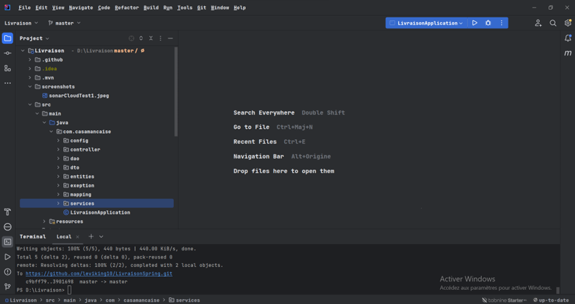
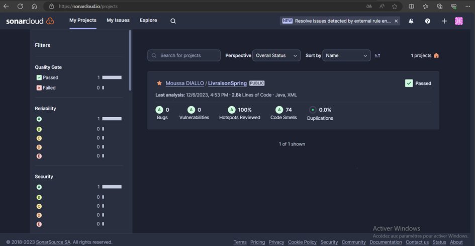
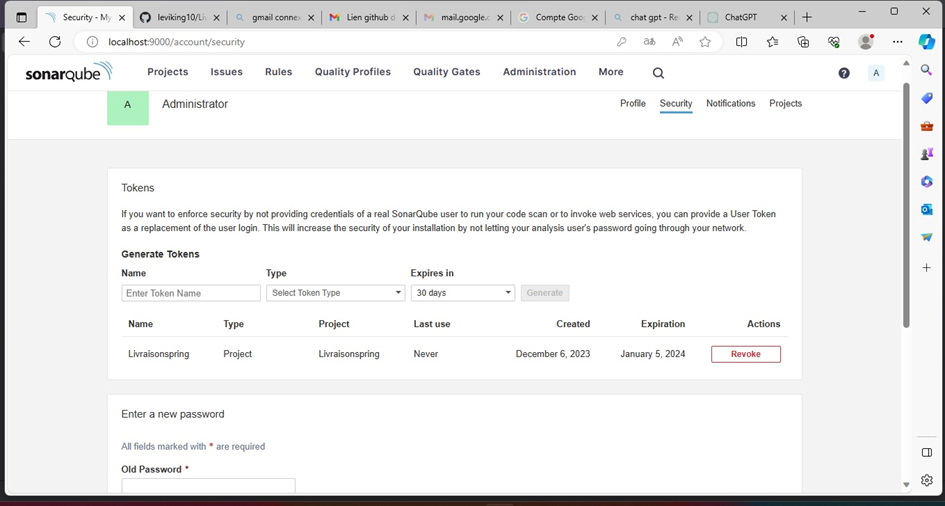

##            Rapport d'Analyse de Qualité de Code - Projet LivraisonSpring
##  Introduction
Ce rapport détaille les résultats de l'analyse de qualité du code du projet "LivraisonSpring", 
un système de gestion de livraison conçu en Java. L'évaluation a été réalisée à l'aide des outils SonarLint, 
SonarQube et SonarCloud, visant à assurer la conformité aux bonnes pratiques de développement 
et à améliorer la lisibilité et la maintenabilité du code.
## Structure du Projet
Le projet comprend plusieurs entités qui représentent les aspects fonctionnels d'un système de gestion de livraison,
tels que Article, Client, Commande, DetailCommande, Vente, et Employee. 
Chaque entité est définie avec des champs spécifiques et des relations OneToMany ou ManyToOne 
qui reflètent la logique métier et les interactions des données.
## Analyse de la Qualité du Code
Les outils d'analyse de code ont été configurés pour examiner le code à la recherche de bugs,
de vulnérabilités, de "code smells", et de duplications. SonarLint a été utilisé en local
pour une analyse instantanée lors de l'écriture du code, tandis que SonarQube et SonarCloud
ont été intégrés dans le pipeline CI/CD pour des analyses plus approfondies et un suivi continu 
de la qualité du code.
##  Résultats de SonarCloud
#### •	Qualité Générale : Le Quality Gate a été passé avec succès, indiquant que le projet répond aux critères de qualité fixés.
#### •	Fiabilité : Aucun bug n'a été identifié, attribuant une note de fiabilité 'A'.
#### •	Sécurité : Aucune vulnérabilité n'a été détectée, assurant une bonne sécurité du code.
#### •	Maintenabilité : 37 "code smells" ont été trouvés, indiquant des opportunités pour améliorer la lisibilité et réduire la dette technique.
#### •	Duplications : Aucune duplication de code n'a été constatée, ce qui est positif pour la maintenabilité du code.
## Recommandations

#### •	Refactoring : Les "code smells" identifiés devraient être examinés et corrigés pour éviter toute complexité accrue.
#### •	Révision de Code : Un processus de revue de code devrait être mis en place pour prévenir l'introduction de nouvelles odeurs de code.
#### •	Tests et Documentation : Augmenter la couverture des tests et améliorer la documentation du code pour chaque entité et relation.
## Conclusion
L'analyse a révélé que le projet est de haute qualité en termes de fiabilité et de sécurité. 
Cependant, l'amélioration de la maintenabilité reste un domaine d'intérêt. 
L'adoption de ces recommandations contribuera à améliorer la qualité globale 
et à garantir une évolution saine du projet.
#### Ci-dessous les captures du projet et l’analyse de sonarCloud et 	SonarCube.

### Le Screenchot du premier test

### Voici la capture de SonarCube déjà configuré où nous pouvons analyser notre projet aussi

